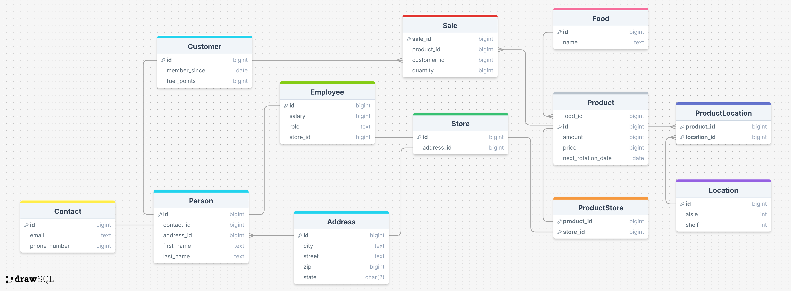

# Grocery Store

This project models data that would be useful for a grocery store, including
food, employees, customers, sales, and store information.



## Query it did well on

__Question__: _What is the most purchased food?_

__SQL Response__:

```sqlite
WITH totals AS (
  SELECT f.name, SUM(s.quantity) AS total_quantity
  FROM Sale s
  JOIN Product p ON p.id = s.product_id
  JOIN Food f ON f.id = p.food_id
  GROUP BY f.id, f.name
)
SELECT name, total_quantity
FROM totals
WHERE total_quantity = (SELECT MAX(total_quantity) FROM totals);
```

__Natural response__: The most purchased food is apple, with 20 units sold.

This used the 1-shot single-domain approach, whose response I preferred
to the zero-shot. The zero-shot simply ordered the selection and limited 
the selection to one (if multiple food items had the same purchase amount,
it would have missed some). I also appreciated that it correctly evaluated the 
quantity of the food and not just the number of sales.

## Query it failed on

__Question__: _Where can you purchase beef?_

__SQL Response__:

```sqlite
SELECT p.first_name, p.last_name
FROM Employee e
JOIN Person p ON p.id = e.id
JOIN Customer c ON c.id = p.id;

SELECT DISTINCT s.id AS store_id, a.street, a.city, a.state, a.zip
FROM Food f
JOIN Product pr ON pr.food_id = f.id
JOIN ProductStore ps ON ps.product_id = pr.id
JOIN Store s ON s.id = ps.store_id
JOIN Address a ON a.id = s.address_id
WHERE f.name LIKE '%beef%';
```

__Natural response__: _None_

The 1-shot single domain approach failed twice because it repeated the
example prompt in its response. Although this is in part due to the ambiguity
in the prompt, it did succeed twice as well. While this is not wrong per se, its 
response to both questions--even the already answered one is odd. It would
probably succeed if, as with the cross-domain, the example was explicitly labelled
as an example.

Even though both prompts (i.e., sql and natural response) included the schema,
all three strategies failed to include the in-store location in response to the 
question `Where can you purchase beef?`. This, again, may be more related to the 
prompt failing to specify aisle and location, but it was somewhat disappointing 
particularly for the zero-shot query, which successfully joined in the location
but excluded it from the natural response

---------------------------------------------------------------

I tried three strategies:

zero-shot, 1-shot single domain, 1-shot cross-domain

I thought the 1-shot single domain did not perform as well, often including
the sample response in its own response. However, the sql for most of the strategies
collected the correct information. Although all the strategies successfully identified
the store where you can purchase beef, they failed to specify the aisle and shelf, which
was available in the schema. In other words, the interpretation of the data was 
generally weaker than the sql, although the 1-shot erroneously included two sql statements.

Overall, ChatGPT 5 does quite well at getting the correct information, but sometimes
fails to interpret it entirely correctly. Therefore, I think it presents a good tool for someone
who could independently interpret or verify the queries, eliminating most of the effort
for most queries, but there is certainly a chance that it is misleading or slightly off
in some of its responses. 

See examples [here](examples.md)